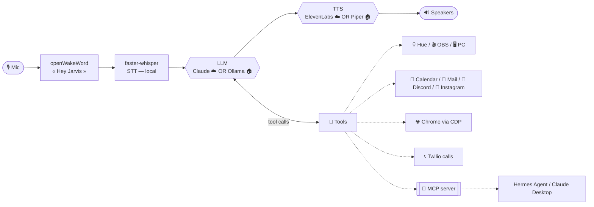

# 🤖 Jarvis — local-first voice assistant

*[Version française](README.fr.md)*


A French-speaking voice assistant that runs **on your own machine**. Say *"Hey Jarvis"*,
speak naturally, and it reasons with an LLM, uses a growing toolbox (smart home, PC,
web, phone…), and answers out loud. Runs in **cloud mode** (Claude + ElevenLabs) or
fully **offline local mode** (Ollama + Piper) — your choice, one line of config.

> Personal project shared as-is. Targets **Windows 11**, needs a microphone and (for
> cloud mode) an Anthropic API key. Most integrations are **optional** and disable
> themselves cleanly when unconfigured.

## ✨ Features

- 🎙️ **Voice-first** — wake word (openWakeWord), local transcription (Whisper), spoken replies
- 👁️ **Screen vision** — "what's this error?", "read this", "translate that" (screenshot → LLM)
- 💡 **Smart home** — Philips Hue (on/off, brightness, color), light scenes & moods
- 🎬 **Streaming** — OBS control (stream, record, scenes, replay buffer)
- 🖥️ **PC control** — launch apps, media/volume, live GPU/CPU/RAM stats
- 📅 **Calendar** — Google Calendar across **all** your calendars (incl. subscribed iCal), create/delete with confirmation
- 📧 **Email** — Gmail summaries and drafting
- 💬 **Discord** — mentions + daily channel digest
- 📸 **Instagram** — followers & video views vs. yesterday (multi-account)
- 🍽️ **Web reservations** — books restaurants/appointments via a real browser (Playwright)
- 🌐 **Browser assistant** — summarize/translate the active tab, manage tabs, act on pages (your real Chrome)
- 📞 **Phone calls** — Twilio: play a message, or a real-time conversation (make a reservation by phone)
- 🧠 **Long-term memory** — remembers your preferences, people, projects
- 🎭 **Personalities** — sarcastic butler, neutral, concise — switch by voice
- 🏠 **Presence** — pings your phone, triggers scenes when you leave/return
- 🌤️ **Utilities** — weather, timers, time/date
- 🔌 **MCP server** — exposes home/PC tools to any MCP client (Claude Desktop, Hermes…)

## 🎬 Demo

> 📺 *Demo video / GIF coming soon — placeholder.*

## 🏗️ Architecture



## ☁️ Cloud vs 🏠 Local

| | **cloud** (default) | **local** (offline) |
|---|---|---|
| LLM | Claude (Anthropic API) | Ollama (`qwen2.5:7b`…) |
| Voice | ElevenLabs | Piper (French) |
| Transcription | faster-whisper (local) | faster-whisper (local) |
| Quality | highest | good (model-dependent) |
| Cost | pay-per-use | free |
| Privacy | API calls | **nothing leaves the machine** |
| Hardware | light | GPU recommended |

Switch with a single line: `mode: cloud` or `mode: local`. See [docs/local.md](docs/local.md)
for the honest reliability breakdown (a 7B model handles the core home/PC tools well;
**vision-based features like the browser & web reservations stay cloud-recommended**).

**Local hardware (honest):** Whisper `medium` ≈ 2–3 GB VRAM, `qwen2.5:7b` (Q4) ≈ 5 GB
VRAM. An **8 GB** GPU (RTX 2070/3060) runs both — tight but workable. Piper is real-time on CPU.

## 🚀 Quick start

Requirements: **Python 3.13**, [uv](https://docs.astral.sh/uv/), Windows 11, a mic.

```bash
uv sync
uv run playwright install chromium        # for web reservations / browser
copy config.example.yaml config.yaml      # then fill in what you need
uv run python jarvis14.py
```

Say **"Hey Jarvis"**. The only strictly required setting is `anthropic.cle` (cloud mode)
or a local model (local mode). Everything else is optional.

New to this? See **[INSTALL_WITH_AI.md](INSTALL_WITH_AI.md)** — a step-by-step guide you
can paste into an AI assistant to set everything up.

## ⚙️ Configuration

Everything lives in a single **untracked** `config.yaml` (copy from
`config.example.yaml`, which documents every key). Per-integration guides:

| Integration | Guide |
|---|---|
| Cloud vs local, Ollama, Piper | [docs/local.md](docs/local.md) |
| Philips Hue | [docs/hue.md](docs/hue.md) |
| OBS | [docs/obs.md](docs/obs.md) |
| Google Calendar + iCal | [docs/agenda.md](docs/agenda.md) |
| Presence detection | [docs/presence.md](docs/presence.md) |
| Discord bot | [docs/discord.md](docs/discord.md) |
| Twilio phone calls | [docs/appels.md](docs/appels.md) |
| Browser (Chrome CDP) | [docs/navigateur.md](docs/navigateur.md) |
| Web reservations | [docs/reservation.md](docs/reservation.md) |
| Instagram | [docs/instagram.md](docs/instagram.md) |
| MCP server | [docs/mcp.md](docs/mcp.md) |
| **Perceived latency (UX)** | [docs/latency.md](docs/latency.md) |

## 🛡️ Ethics & Safety

Trust is built in, not bolted on:

- **Voice confirmation** before every irreversible action (send email, book, delete, call…).
- **Phone calls announce themselves** honestly: *"Hi, I'm [name]'s automated voice assistant…"* — never impersonating a human.
- **Never** enters passwords or payment details, and never auto-pays.
- **Protected domains** (banking, taxes, health) on your real browser are **read-only** — Jarvis refuses to act there.
- **Secrets & personal data are never committed** (`config.yaml`, memory, logs, call transcripts, OAuth tokens — all gitignored).
- The assistant only confirms, by phone, what you validated **before** the call.

## 🗺️ Roadmap

- [ ] Godox video-light control (currently Hue only)
- [ ] Notes & reminders tools
- [ ] Sentence-by-sentence streaming TTS (see [docs/latency.md](docs/latency.md))
- [ ] Local vision model for the browser loop (currently cloud-only)
- [ ] Automatic Instagram token refresh across restarts (partial today)

## 🤝 Contributing

Adding a tool is a single file in `tools/` with an `@outil(...)` decorator — it's
auto-discovered, no wiring needed. Issues and PRs welcome. Please don't commit any
real secrets (check `.gitignore`).

## 📄 License

MIT — see [LICENSE](LICENSE).
